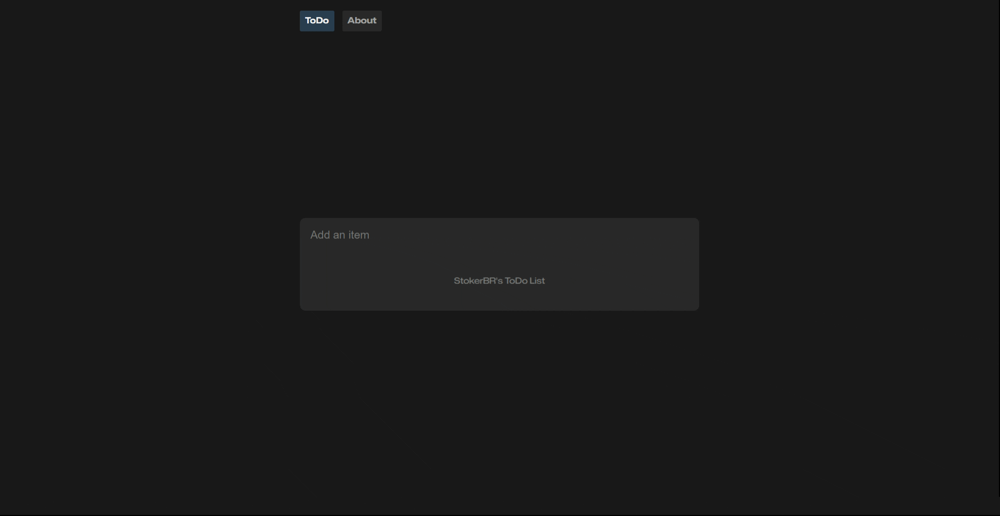

# Vue ToDo App ✅ 

Welcome to my simple ToDo app built with VueJS! ✨

This application was created as a personal project to learn and improve my skills in VueJS, practicing core concepts such as components, directives, data binding, validation, and routing. 👨‍💻

The app helps you keep track of your tasks with a clean and minimalist interface, allowing you to add new tasks, mark them as completed, and delete them. 📝

## See for yourself 🚀

To see this app in action, or run it for development, just clone this repository, cd into it and run the following commands:

_You will need to have Node installed._

- `npm install`
- `npm run dev`

This will start the application at http://localhost:5173/ 💻

Enjoy! 😎